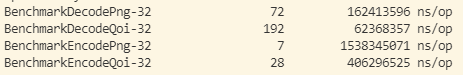

## goi - The “Quite OK Image” format encoder / decoder for Go.

QOI - The “Quite OK Image” - is losslessly image format that offering speedup both compression and decompression and simple implementation.

See the original repository for details.
https://github.com/phoboslab/qoi

# LICENSE

MIT
